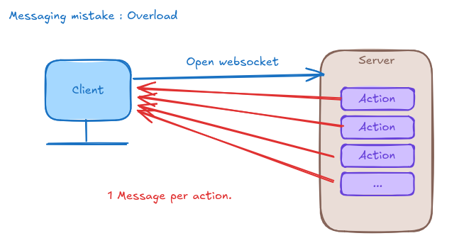
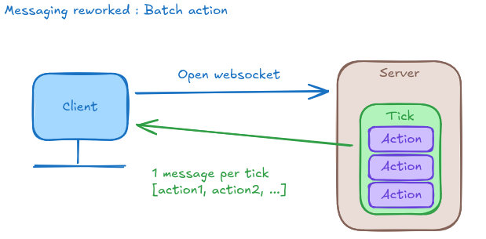
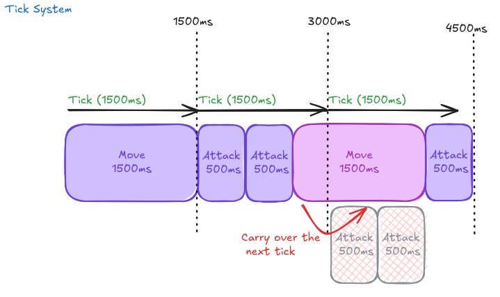

  
  <!-- - Client handles stack of event one by one 
    - Event Queue Stack 
    - Progress in event (Duration / frame)
    - Mistake of add each event to its entity -> leading to loosing the order of each actions !
- Some architecture concept to easily integrate new GameEvent / action -->


Project overview: [Autobattle project](../03-autobattle-project)


## The Problem : Death by Event Spam


The game is passive for player but a lot happens in the background.
The server needs to compute each possible actions such as :
- the player move to a position 
- the player attack a target
- a target is moving

The client is responsible to turn those background action into nice visuals for the player.


### How does the server communicate with the client ?


My first mistake was to assume the server will notify the client through the websocket as soon as an action is made.



At first it was very straightforward, the server moved my character, then notify the client through the websocket : The character move from x to y.


```kotlin
// Every entity movement = 1 WebSocket message
entity.move()
webSocket.send(EntityMoved(entity.id, entity.position))
```

But those actions are very "short" time-wise. This was leading to a lot of message within a single second and it was only with 1 Character and 1 Target !

**At 10 entities, 50 ms server tick:**
- 200 messages/second per client, each ~400B
- 2000 messages/second at 10 concurrent players
- **6.4 MBits/s** only for movement.

This doesn't scale. WebSocket connections start dropping, client lag, server CPU maxes out on serialization.

I had to solve my first conception problem : How to keep the game running in both the server and the client without overloading the websocket.

## The Solution: Event Batching Per Tick

**Instead of:** 1 WebSocket message per event.<br>
**Use:** 1 WebSocket message per server tick, containing all events


```kotlin
fun onTick() {
    val events = mutableListOf()
    
    // Collect all events during tick
    entities.forEach { entity ->
        entity.update(deltaTime)
        if (entity.positionChanged) {
            events.add(EntityMoved(entity.id, entity.position))
        }
    }
    
    // Single message with batched events
    webSocket.send(TickUpdate(
        tick = currentTick,
        timestamp = System.currentTimeMillis(),
        events = events
    ))
}
```

**Result:**
- 200 events/sec -> Still processed
- 200 messages/sec -> **less than 1** message/sec (if tick is 1500ms)<br>

Is 1.5s tickrate acceptable ?
Far an auto battle where player is not controlling combat, yes.
For a shooter and a fighting, no. You would need 50ms tickrate for quick reaction.

**Create a queue of actions**. And here was the solution for my first problem, batch actions.




## The Trade-Off: Client Complexity

**Server got simplier. Client got hard.**

```javascript
// Client now receives bursts of events
socket.on('tick-update', (update) => {
    // Problem: 10 position updates in same frame
    // Naive: Apply all instantly → entities teleport
    // Solution: Interpolate over tick duration (50ms)
    
    update.events.forEach(event => {
        eventQueue.push({
            event: event,
            timestamp: update.timestamp
        })
    })
    
    // Render loop applies events gradually
    requestAnimationFrame(() => {
        interpolateEvents(eventQueue, currentTime)
    })
})
```

**Client now needs:**
- Event queue (buffer between ticks)
- Interpolation logic (smooth movement)
- Time syncronization (server tick -> client frame)


### Server also got impacted

The server need to queue actions and send a message to the client with a fix rate with the pile of actions. This involves rethinking the way we handle actions.

Previously it was very simple, the server apply an action and send the action to the client with the duration. The client rendered it in the given duration.
Now with a queue of actions it's different.
The client need to take them one by one and to calculate its progress to display a smooth action.
More on that later.


### How Ticks Work

**Fixed tick rate: 1500ms (configurable)**

**Tick 1:**
- Server queues: Move (1500ms duration)
- Tick filled → Send message: `[Move]`

**Tick 2:**
- Server queues: Attack (500ms), Attack (500ms), Move starts (500ms used)
- 1500ms filled → Send message: `[Attack, Attack, Move(partial)]`

**Tick 3:**
- Carry-over: 1000ms remaining from Move
- Server queues: Attack (500ms)
- 1500ms filled → Send message: `[Move(continued), Attack]`




## This Pattern Apperas Everywhere

**Applications:**
- Market data feeds (batch stock ticks)
- Multiplayer games (State snapshot)
- Collaborative editing (batch keystrokes)

**The pattern:**
1. High-frequency events (movement, trades, keystrokes)
2. Batched into fixed time windows (ticks)
3. Sent as single message (reduces overhead)
4. Client interpolates between batches (smooth UX)


Coming next : Scheduling action, vector manipulation, queue event in the client side, browser throttling

**Previous post: [From Shade](../00-story-From_Shade)**
